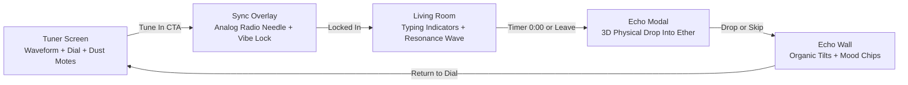

# 🌊 Wavelength — Synchronous Social Space

> *"not who you follow. who you're in sync with, right now."*  
> An ephemeral, synchronous social web application built without profiles, follower counts, like tallies, permanent logs, or algorithmic sorting.

[](https://chetanbhagore.github.io/Wavelength/)
[](https://vitejs.dev/)
[](https://react.dev/)
[](https://tailwindcss.com/)
[](https://www.framer.com/motion/)

---

## 🌐 Live Deployment & Competition Links

- **Live URL**: [https://chetanbhagore.github.io/Wavelength/](https://chetanbhagore.github.io/Wavelength/)
- **GitHub Repository**: [https://github.com/chetanbhagore/Wavelength.git](https://github.com/chetanbhagore/Wavelength.git)
- **Judge Review Shortcut**: Press **`Shift + D`** anywhere in the app to toggle **90s Demo Mode** (default: ON) vs **12m Standard Mode**. Alternatively, double-click the top-left *Wavelength* logo glyph.

---

## 🏛️ The Anti-Metric Manifesto

Modern social media turns human emotional connection into a leaderboard of vanity metrics: follower tallies, like counts, and algorithmic outrage.

**Wavelength reimagines social connection from first principles**:
1. **Zero Profiles & Zero Follow Counts**: You are not a brand. You enter each frequency as an anonymous presence (`stranger_XX`).
2. **Collective Resonance Over Individual Likes**: Tapping a message doesn't increment a counter; it illuminates the entire room with an expanding radial light wave and surges collective room energy.
3. **Presence Residue**: Departing a room leaves a gentle ghost halo on the dial for future visitors, without saving user identities.
4. **Physical Echo Ritual**: When a 12-minute ephemeral room expires or you choose to depart, you can drop a single-line echo (~80 characters) into the ether with a 3D perspective physical drop animation.
5. **No Algorithmic Feeds**: The Echo Wall displays reflections chronologically. No upvoting, no ranking, no viral optimization.

---

## 🌟 Version 2 Elevation: Master 4-Sprint Delivery

Following a strict **39-point Judge Audit Report**, Wavelength was elevated across 4 comprehensive sprints:

### 🎛️ Sprint 1: Atmospheric Design & Analog Tuning
- **Analog Radio Frequency Scanner**: Re-engineered `SyncOverlay` with a sweeping illuminated needle, frequency lock indicator, stranger sync dots, and `99.2% Phase Match` alignment badge.
- **Tactile Frequency Dial**: 5px active tick markers, 12 o'clock needle, spring physics (`stiffness: 260, damping: 26`), and center-orb tactile light flare on snap.
- **Generative Waveform Canvas & Motes**: 42 floating stardust particles that dynamically adjust speed and hue based on mood velocity.
- **Obsidian CTA & Glass Readout**: Monospace audience counter with Brownian fluctuation animations.

### 🛋️ Sprint 2: The Living Room & Resonance Surge
- **Lifelike Human Cadence**: Dynamic typing indicator (`stranger_XX is typing...`) with 3-dot pulse, randomized human reading/typing pauses (1.6s–3.2s), and conversational bursts.
- **Simulated Peer Resonance**: Active strangers occasionally resonate with messages (especially affirming user thoughts).
- **Collective Room-Wide Illumination**: Tapping resonance triggers a room-wide backdrop radial light wave and meter beam surge.
- **Progressive Sunset Countdown**: Smooth multi-stage interpolation:
  - `> 90s`: Ethereal Violet (`#7C5CFF`)
  - `90s - 30s`: Warm Amber Sunset (`#FFB020`)
  - `< 30s`: Twilight Crimson (`#FF5470`)
- **Poetic Departures**: Serene arrival toast (*"You're in sync. 4 strangers are here"*), and early departure confirmation dialog.
- **Anti-Metric Philosophy Popover**: Explains the *"Why No Likes?"* philosophy directly on the resonance bar.

### 🌌 Sprint 3: Presence Residue & Echo Ritual Elevation
- **Dial Presence Residue**: Ethereal breathing ghost halo on the tick mark of the frequency just vacated (*"strangers were just here"*).
- **Return Continuity Memory**: Anonymous visit tracker showing discrete return cues (*"you tuned here earlier"*).
- **3D Physical Echo Drop**: Perspective card fall (`rotateX: 45deg, scale: 0.55, translateY: 140px`) with dissolution particle sparks.
- **Organic Echo Wall Cards**: Deterministic organic card tilt angles (`-0.56deg` to `+0.56deg`), depth shadows, and left mood glow borders.
- **Reactive Filter Chips**: Filter chips dynamically inherit the glowing accent color and mood pip of that frequency.
- **Poetic Empty States**: Mood-tailored quiet messages (*"The silence on 94.2 MHz is waiting for your words"*).
- **Composer Limit Cue**: Minimal character countdown that smoothly fades in within 30 chars of the limit.

### 💎 Sprint 4: Technical Polish, Accessibility & Zero-Tolerance QA
- **Borderless Glass Navigation**: Header buttons softened into ethereal glass pills that blend into the void.
- **Discrete Demo Mode**: Removed intrusive header buttons; toggleable via global `Shift+D` shortcut or logo double-click.
- **Brownian Motion Audience Model**: Realistic Ornstein-Uhlenbeck stochastic drift with mean reversion replacing linear arithmetic.
- **Rigorous Accessibility**: Universal `focus-visible` glowing purple rings and complete `@media (prefers-reduced-motion: reduce)` fallbacks.
- **Clean Architecture**: 0 lint errors (`oxlint`), 0 build errors (`vite build` in ~1.2s), and 100% semantic git history.

---

## 🛠️ Architecture & Tech Stack



- **Framework**: [React 19](https://react.dev/)
- **Build Tool**: [Vite 8](https://vitejs.dev/) with `base: './'` for universal asset routing
- **Styling**: [Tailwind CSS v4](https://tailwindcss.com/) + Custom HSL Design Tokens
- **Animations**: [Framer Motion](https://www.framer.com/motion/)
- **Icons**: [Lucide React](https://lucide.dev/)
- **Linter**: [OxLint](https://oxc.rs/)

---

## 🚀 Running Locally

```bash
# Clone the repository
git clone https://github.com/chetanbhagore/Wavelength.git
cd Wavelength

# Install dependencies
npm install

# Start development server
npm run dev

# Run linter
npm run lint

# Build for production
npm run build
```

---

## 📄 License

MIT License • Created with craft for the Frontend Odyssey Challenge.

