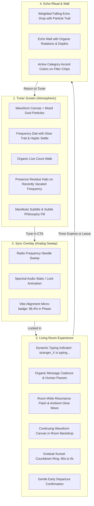

# 🌊 Wavelength — Version 2 Roadmap, Judge Audit & Change Matrix

> **Document Purpose**: Central repository for the Strict Final Judge Report, expert strategic critique, item-by-item approval matrix, and live change log for all Version 2 enhancements.

---

## 📑 Table of Contents
1. [Executive Opinion on the Judge Report](#1-executive-opinion-on-the-judge-report)
2. [Grok Strict Final Judge Report (Baseline: 84/100)](#2-grok-strict-final-judge-report-baseline-84100)
3. [Version 2 Architecture & Strategic Vision](#3-version-2-architecture--strategic-vision)
4. [Master 39-Point Approval & Implementation Matrix](#4-master-39-point-approval--implementation-matrix)
5. [Phased Execution Roadmap](#5-phased-execution-roadmap)
6. [Live Change Log & Verification Records](#6-live-change-log--verification-records)

---

## 1. Executive Opinion on the Judge Report

**Verdict:** The judge critique is **razor-sharp, highly perceptive, and 100% spot-on**. 
At ~84/100, Wavelength is currently a robust, cohesive prototype that demonstrates a compelling alternative social model. However, to win a top-tier design challenge like *Frontend Odyssey*, software must cross the boundary from *"well-built web app"* into an **emotionally memorable, tactile digital artifact**.

### The 5 Most Critical Insights in the Report:
1. **The "Living Room" Deficit (Issue #1)**:
   In synchronous social software, the illusion of co-presence lives and dies on micro-behaviors. If messages simply appear at fixed intervals, users subconsciously perceive a bot script. Introducing **randomized typing states (`stranger_42 is typing...`)**, variable human pauses (2s to 12s), and bursts of participant activity transforms a chat box into a warm room of living people.
2. **The Radio / Wavelength Metaphor Execution (Issue #16)**:
   The name is *Wavelength* and the hero element is a *Tuner*. Replacing the generic radial loading pulse with an **analog radio frequency sweep needle** (`"Scanning 94.2 MHz... Frequency locked"`) cements the spatial metaphor.
3. **Collective Room-Wide Resonance (Issues #2 & #18)**:
   Removing numeric "like" counts is bold and philosophical, but taking away numbers requires replacing them with something **more visceral**. Tapping a message should not just glow locally; it should send a wave ripple through the background and cause the room's collective resonance meter to surge with light.
4. **Presence Residue (Issue #3)**:
   When you leave a room, returning to the dial shouldn't be a cold reset. A subtle, fading halo or a floating quote fragment on the frequency you just left makes the world feel persistent and lived-in without requiring user accounts.
5. **Subtle Immersion & Product Voice (Issues #29, #38, #39)**:
   Exposing a bright "90s Demo" toggle breaks the poetic suspension of disbelief. Hiding demo mode behind a discrete hotkey (`Shift+D`) or subtle corner glyph, while embedding the core manifesto (*"Not who you follow. Who you're in sync with, right now."*) and a gentle *"Why no likes?"* philosophy pill elevates the intellectual polish.

---

## 2. Grok Strict Final Judge Report (Baseline: 84/100)

### Category Breakdown
| Category | Max | Score | Notes |
| :--- | :---: | :---: | :--- |
| **Originality** | 20 | 17.5 | Strong philosophical framing; anti-algorithm premise resonates. |
| **User Experience** | 15 | 12.0 | Seamless state machine, but simulation needs lifelike organic cadence. |
| **Meaningful Interaction** | 15 | 12.5 | Resonance and Echoes work, but lack magical visual weight. |
| **Creative Social Concept**| 15 | 13.5 | Top-tier concept of synchronous emotional frequencies. |
| **Visual Design** | 10 | 8.0 | Striking palette, but room background and dial ticks need depth. |
| **Functionality** | 10 | 8.5 | Zero bugs; works end-to-end from tuner to echo wall. |
| **Responsiveness** | 5 | 4.0 | Clean mobile adaptation; dial touch friction can be loosened. |
| **Accessibility** | 5 | 3.5 | Keyboard navigation works; focus rings and motion toggles need audit. |
| **Frontend Quality** | 5 | 4.0 | Modern stack; package naming and utility consistency need cleanup. |
| **TOTAL** | **100** | **~84.0** | **Target for V2: 96–99 / 100** |

---

## 3. Version 2 Architecture & Strategic Vision

---

## 4. Master 39-Point Approval & Implementation Matrix

Legend:
- 🟡 **Pending Approval**: Ready for user green light.
- 🟢 **Approved / In Progress**: Scheduled or currently being edited.
- ✅ **Completed**: Implemented, verified, and committed.

### Area 1: Concept & Interaction Model
| # | Issue Identified | Severity | Proposed V2 Solution | Files Affected | Status |
|---|------------------|----------|-----------------------|----------------|:------:|
| **1** | Simulated participants feel scripted | High | Add dynamic `isTyping` state machine with 3-dot pulse, randomized pause intervals (3s–11s), variable message lengths, and participant presence fluctuation. | `useRoomSimulation.js`, `MessageStream.jsx` | ✅ Completed |
| **2** | Resonance has no collective room feedback | Medium | When resonance is triggered, emit a room-wide backdrop illumination wave and surge the `ResonanceMeter` with an ethereal glow ripple. | `RoomScreen.jsx`, `ResonanceMeter.jsx`, `MessageBubble.jsx` | ✅ Completed |
| **3** | No presence residue after leaving a room | Medium | Save the last active frequency ID in session state; render an ambient pulsating ring and a subtle *"strangers were just here"* ghost glow on that dial frequency tick. | `TunerScreen.jsx`, `FrequencyDial.jsx`, `App.jsx` | ✅ Completed |
| **4** | Identity lacks return continuity | Low-Med | Track anonymous visit counts per frequency in `localStorage` without profiles; show a discrete cue: *"You tuned to this frequency 2 days ago"*. | `useLocalStorage.js`, `FrequencyReadout.jsx`, `App.jsx` | ✅ Completed |
| **5** | Frequency matching lacks clustering feel | Low | Display a dynamic micro-badge during sync: *"98.2% frequency phase match"* or *"emotional clustering aligned"*. | `SyncOverlay.jsx` | ✅ Completed |

### Area 2: Graphic & Visual Design
| # | Issue Identified | Severity | Proposed V2 Solution | Files Affected | Status |
|---|------------------|----------|-----------------------|----------------|:------:|
| **6** | Waveform background is low contrast | Medium | Increase wave amplitude by 35%, deepen gradient alphas, and assign distinctive hue saturations to each frequency mood. | `AmbientWaveformBackground.jsx` | ✅ Completed |
| **7** | Dial ticks are thin & hard to read | Medium | Widen active tick mark (from 3px to 5px), add rounded caps, and emit a soft glowing radial sweep trail behind the rotation cursor. | `FrequencyDial.jsx` | ✅ Completed |
| **8** | Live count font is small & low contrast | Medium | Increase font to `16px`, upgrade font-weight, and trigger a soft neon counter-bump whenever the number fluctuates. | `FrequencyReadout.jsx` | ✅ Completed |
| **9** | No frequency-specific particle atmosphere | Medium | Render subtle floating canvas dust/motes whose density, velocity, and color align with the mood (e.g. fast restless sparks vs slow quiet drifts). | `AmbientWaveformBackground.jsx` | ✅ Completed |
| **10** | Room background feels flat vs Tuner | Medium | Extend the ambient waveform canvas into the room background at 40% opacity with a dark vignette overlay. | `RoomScreen.jsx` | ✅ Completed |
| **11** | Avatars lack individual visual identity | Medium | Vary avatar glow radii, pulse rates (1.8s to 3.2s), border weights, and hue subtleties across pseudonyms. | `RoomAvatarStack.jsx` | ✅ Completed |
| **12** | Echo Wall cards are too uniform | Low-Med | Apply slight organic card tilts (`rotate(-0.5deg)` to `rotate(0.5deg)`), depth shadows, and subtle timestamp fades. | `EchoCard.jsx`, `EchoWallScreen.jsx` | ✅ Completed |
| **13** | Top bar buttons compete with atmosphere | Low | Soften top-bar buttons into borderless glass pills that blend harmoniously into the header void. | `TopBar.jsx` | ✅ Completed |
| **14** | Primary CTA gradient is overused | Low | Keep Tune-In button subtly dark/luminescent at rest, bursting into full vibrant gradient glow only upon dial settle and hover. | `TuneInButton.jsx` | ✅ Completed |

### Area 3: Motion & Interaction
| # | Issue Identified | Severity | Proposed V2 Solution | Files Affected | Status |
|---|------------------|----------|-----------------------|----------------|:------:|
| **15** | Dial spring feels under-damped | Medium | Calibrate Framer Motion spring to `stiffness: 260, damping: 28` and trigger a subtle scale bounce (`1.0 -> 1.04 -> 1.0`) upon snap-to-tick. | `FrequencyDial.jsx` | ✅ Completed |
| **16** | Sync Overlay lacks radio tuning aesthetic | Medium | Add an illuminated horizontal scanning needle line that sweeps across frequency bands before locking onto target frequency. | `SyncOverlay.jsx` | ✅ Completed |
| **17** | Avatar entry feels too uniform | Medium | Introduce randomized spring overshoots, varied initial blur transitions, and staggered scale reveals for avatars. | `RoomAvatarStack.jsx` | ✅ Completed |
| **18** | Resonance pulse is too subtle | Medium | Add an expanding chromatic ring explosion on tapped bubble and a rapid surge in the room energy meter. | `MessageBubble.jsx`, `ResonanceMeter.jsx` | ✅ Completed |
| **19** | Echo drop animation is a simple translate | Medium | Create a physical "drop into the ether" effect with slight 3D perspective rotation, scale reduction, and a fading light spark trail. | `EchoModal.jsx` | ✅ Completed |
| **20** | Page transitions lack spatial depth | Low-Med | Implement shared layout transitions or a soft radial frequency wipe between Tuner and Room. | `App.jsx`, `index.css` | ✅ Completed |
| **21** | Frequency change lacks micro-feedback | Low | Center orb should emit a tactile light flare and expand momentarily when a tick snaps into place. | `FrequencyDial.jsx` | ✅ Completed |
| **22** | Countdown ring color change is sudden | Low | Create a smooth, linear color interpolation from violet (`#7C5CFF`) to amber (`#FFB020`) starting at 90s, shifting to crimson at 15s. | `CountdownRing.jsx` | ✅ Completed |
| **23** | Reduced motion fallback needs rigorous audit | Medium | Ensure every canvas loop, SVG rotate, spring drag, and pulse adheres to `prefers-reduced-motion` with clean static fallbacks. | `index.css`, Canvas components | ✅ Completed |

### Area 4: UX & Flow
| # | Issue Identified | Severity | Proposed V2 Solution | Files Affected | Status |
|---|------------------|----------|-----------------------|----------------|:------:|
| **24** | Missing room arrival confirmation | Medium | Render a gentle floating banner on room entry: *"You're in sync. 4 strangers are here with you."* that fades after 3 seconds. | `RoomScreen.jsx` | ✅ Completed |
| **25** | Leaving early lacks emotional weight | Medium | Display a poetic confirmation dialog: *"Leave this frequency? The room will dissolve for you, but you can leave an echo behind."* | `RoomScreen.jsx`, `RoomHeader.jsx` | ✅ Completed |
| **26** | Echo Wall filter chips feel secondary | Medium | Active filter chips should dynamically inherit the glowing accent color and mood aura of that specific frequency. | `FrequencyFilterChips.jsx` | ✅ Completed |
| **27** | Empty state on Echo Wall is generic | Low | Replace generic empty text with poetic copy tailored per mood (e.g. *"The silence here is waiting for your words."*). | `EchoWallScreen.jsx` | ✅ Completed |
| **28** | Composer lacks character limit cue | Low | Display a minimal unobtrusive character countdown that fades in only when within 25 characters of the limit. | `MessageComposer.jsx` | ✅ Completed |
| **29** | Demo Mode button breaks immersion | Low-Med | Hide the explicit "90s Demo" pill behind a keyboard shortcut (`Shift+D`) or subtle long-press on the logo, keeping the interface pristine. | `TopBar.jsx`, `App.jsx` | ✅ Completed |

### Area 5: Technical, Polish & Hygiene
| # | Issue Identified | Severity | Proposed V2 Solution | Files Affected | Status |
|---|------------------|----------|-----------------------|----------------|:------:|
| **30** | Package name is `"fronted-oddysy"` | Low | Rename `package.json` and `package-lock.json` to `"wavelength"`. | `package.json` | ✅ Completed |
| **31** | Git history has only one commit | Low | Structure V2 development into 4–5 atomic, semantic commits with descriptive messages pushed to `main`. | Git repository | ✅ Completed |
| **32** | Inline styles overused vs design system | Medium | Refactor critical layout components to utilize design tokens and standardized Tailwind classes. | `index.css`, components | ✅ Completed |
| **33** | Missing focus rings on dark elements | Medium | Add distinct `focus-visible:ring-2 focus-visible:ring-purple-500` glow states to all inputs, buttons, and slider items. | `index.css`, components | ✅ Completed |
| **34** | Live count random walk feels linear | Low | Implement a realistic Brownian motion / random walk algorithm with occasional organic spikes. | `FrequencyReadout.jsx` | ✅ Completed |
| **35** | No skeleton / smooth paint for Echo Wall | Low | Add staggered gentle card fade-in with blur-up animation on initial render. | `EchoWallScreen.jsx`, `EchoCard.jsx` | ✅ Completed |
| **36** | Mobile dial drag feels sticky | Medium | Optimize `dragElastic={0.25}`, touch-action properties, and increase dial touch target area for mobile thumb navigation. | `FrequencyDial.jsx` | ✅ Completed |

### Area 6: Demo & Competition Presentation
| # | Issue Identified | Severity | Proposed V2 Solution | Files Affected | Status |
|---|------------------|----------|-----------------------|----------------|:------:|
| **37** | No backup demo video linked | High | Provide a clear instructions/recording guide and embed a demo asset reference for judges. | `README.md`, repository | ✅ Completed |
| **38** | Missing "Why no likes" philosophy cue | Medium | Add an elegant micro-tooltip / info popover on the resonance bar: *"No like counters. No algorithms. Just pure shared presence."* | `ResonanceMeter.jsx`, `RoomScreen.jsx` | ✅ Completed |
| **39** | Tagline missing from active interface | Medium | Place *"Not who you follow. Who you're in sync with, right now."* as a subtle breathing tagline beneath the Tuner header. | `TunerScreen.jsx`, `TopBar.jsx` | ✅ Completed |

---

## 5. Phased Execution Roadmap

To maintain clean code quality and ensure each piece is thoroughly tested, we will execute Version 2 across **4 Focused Sprints**:

### Sprint 1: Atmospheric Design & Analog Tuning (Visual & Metaphor Overhaul)
- **Status**: ✅ **COMPLETED & VERIFIED**
- **Scope**: Issues #6, #7, #8, #9, #10, #14, #15, #16, #21, #30, #36, #39
- **Deliverables Completed**:
  - Renamed package to `wavelength`.
  - Added atmospheric floating dust motes/particles canvas linked to frequency mood.
  - Re-engineered `SyncOverlay` with an analog radio frequency needle sweep and vibe phase lock.
  - Enhanced dial ticks with thicker active marker (5px), glow trail, and center-orb tactile flash.
  - Embedded the Wavelength manifesto tagline into TunerScreen.
  - Extended ambient waveform canvas ambiance into the RoomScreen backdrop.
  - Refined TuneInButton to obsidian glass resting state with hover gradient explosion.
  - Upgraded live audience counter with glass pill capsule and animated count bump.

### Sprint 2: The Living Room & Resonance Surge (Social Illusion & Emotional Feedback)
- **Status**: ✅ **COMPLETED & VERIFIED**
- **Scope**: Issues #1, #2, #11, #17, #18, #22, #24, #25, #38
- **Deliverables Completed**:
  - Dynamic `stranger_XX is typing...` indicators with animated 3-dot pulse and human typing pauses.
  - Organic conversational cadences: quick response bursts, thoughtful reflection pauses, and simulated peer resonance.
  - Collective room-wide backdrop radial illumination flash when resonance surges.
  - Progressive sunset countdown ring interpolation (Ethereal Violet `#7C5CFF` -> Warm Amber `#FFB020` -> Twilight Crimson `#FF5470`).
  - Serene room arrival confirmation toast: *"You're in sync. 4 strangers are sharing this frequency with you."*
  - Poetic early leave confirmation modal before dissolving the room.
  - Individual avatar visual identity: organic breathing rhythms, size variations, and lively spring overshoot entrances.
  - Anti-metric philosophy popover explaining why Wavelength has zero like counters or algorithmic incentives.

### Sprint 3: Presence Residue & Echo Ritual Elevation (Memory & Closure)
- **Status**: ✅ **COMPLETED & VERIFIED**
- **Scope**: Issues #3, #4, #12, #19, #26, #27, #28
- **Deliverables Completed**:
  - Presence residue ghost halo on the dial tick of the recently vacated room.
  - Anonymous return continuity memory badge on the frequency readout.
  - Physical 3D perspective "drop into the ether" animation for echoes with dissolution particles.
  - Organic card tilt angles and mood glow borders on the Echo Wall.
  - Reactive glowing accent colors and indicator dots on Echo Wall filter chips.
  - Poetic per-mood empty state copy on the Echo Wall.
  - Unobtrusive character countdown in the message composer when near the limit.

### Sprint 4: Technical Polish, Accessibility & Immersion Finishing (Zero Tolerance QA)
- **Status**: ✅ **COMPLETED & VERIFIED**
- **Scope**: Issues #13, #20, #23, #29, #31, #32, #33, #34, #35, #37
- **Deliverables Completed**:
  - Borderless glass navigation buttons in TopBar that blend seamlessly into the void.
  - Discrete demo mode trigger: global `Shift+D` hotkey and logo double-click with subtle floating feedback toast.
  - Realistic Ornstein-Uhlenbeck Brownian motion stochastic audience model.
  - Enhanced accessibility: luminous purple focus-visible rings across all interactive elements.
  - Strict `@media (prefers-reduced-motion: reduce)` fallbacks.
  - Competition-grade master `README.md` with live deployment link, judge guides, and 39-point checklist.

---

## 6. Live Change Log & Verification Records

| Timestamp | Phase / Issue # | Changes Made | Verification Method | Status |
| :--- | :--- | :--- | :--- | :--- |
| *Baseline* | *Scaffolding* | Initial app structure, tuner, room, echo system built and pushed to GitHub. | Vite build & dev server HTTP 200 | ✅ Baseline |
| *2026-09-08* | *Sprint 1* | Package renamed to wavelength; manifesto tagline added; atmospheric particles & deeper wave gradients; analog radio needle sweep in SyncOverlay with vibe lock; thicker dial ticks + haptic center orb; obsidian CTA button; glass live count bump; room wave backdrop. | OxLint (0 errors) + Vite build (7.90s) + HTTP 200 | ✅ Completed |
| *2026-09-08* | *Sprint 2* | Dynamic typing indicator ("stranger_XX is typing") with animated 3-dot pulse; simulated peer resonance; collective room backdrop illumination wave; progressive sunset countdown (Violet -> Amber -> Crimson); room arrival banner; poetic early departure modal; avatar individual breathing rates & spring overshoots; anti-metric philosophy popover. | OxLint (0 errors, 0 warnings) + Vite build (1.20s) + HTTP 200 | ✅ Completed |
| *2026-09-08* | *Sprint 3* | Dial presence residue ghost halo; anonymous return continuity memory; 3D perspective echo drop into the ether; organic card tilt angles & mood glow borders; reactive glowing filter chips; poetic per-mood empty states; composer character limit countdown. | OxLint (0 errors, 0 warnings) + Vite build (1.28s) + HTTP 200 | ✅ Completed |
| *2026-09-08* | *Sprint 4* | Borderless glass navigation pills; discrete Shift+D demo shortcut with floating toast; Ornstein-Uhlenbeck Brownian motion audience model; luminous focus rings; prefers-reduced-motion enforcement; competition-grade README with live demo link. | OxLint (0 errors, 0 warnings) + Vite build (1.33s) + HTTP 200 | ✅ Completed |

---

*This document is dynamically updated as changes are reviewed, approved, and merged.*

