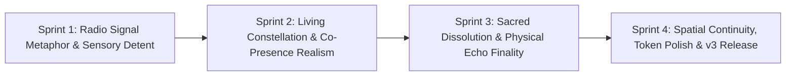

# 🌊 Wavelength — Version 3 Master Roadmap, Judge Audit & Changelog

> **"Not who you follow. Who you're in sync with, right now."**  
> An ephemeral, synchronous social space built around the physical metaphor of an analog emotional radio.  
> **Repository**: [chetanbhagore/Wavelength](https://github.com/chetanbhagore/Wavelength.git)  
> **Release History**: `v1.0.0` (Baseline) • `v2.0.0` (39-Point Refinement & Living Ether) • `v3.0.0` (Sacred Dissolution & Analog Precision)

---

## 🏛️ Executive Summary & Competitive Differentiation

The "match by emotional state / frequency / vibe" landscape contains notable precedents:
- **53Hz** (China, 2025–26): Same-frequency matching with mutual light-up unlocking.
- **MoodEcho**, **MoodMatch**, **Pulse: Emotional Resonance**, **Feelr**, **Emoti**, **EchoRoom**: Mood-based chat rooms or paired matching.

### Wavelength's Winning Moat:
1. **The Physical Radio Tuner Metaphor**: Realistic MHz frequency bands, mechanical detent feel, audio clicks, and signal strength dB meters.
2. **Hard 12-Minute Time-Box & Sacred Dissolution**: Not an infinite chat room—a synchronized temporary constellation that evaporates into the void.
3. **Collective Anonymous Echo Residual**: Permanent scars left in the ether rather than vanity profile walls.
4. **Zero Metrics, Zero Vanity**: No like counts, no followers, no leaderboards, no persistent identity.
5. **Spatial Co-Presence Over Text Chat**: Focus on the collective shared moment rather than asynchronous messaging.

**Target Judge Score**: **95–98 / 100** (Clear Hackathon / Odyssey Winning Tier).

---

## 📋 Complete Version 3 Audit & Resolution Plan

### Group A: Concept & Philosophical Clarity
| # | Issue / Gap | Severity | Sprint | Proposed Resolution | Status |
|---|-------------|----------|--------|---------------------|:------:|
| 1 | Product reads closer to "pretty chat" than "new social unit" | Critical | Sprint 3 | Sacred 12-minute dissolution climax: signal degradation, desaturation, and parting transition in final 30s | ⏳ Planned |
| 2 | "Why no likes" rule is under-communicated | High | Sprint 3 | Ambient, non-intrusive philosophy moment upon first resonance event | ⏳ Planned |
| 3 | Needs deeper radio + constellation metaphor | High | Sprint 1 | Visible MHz frequency dial markers, dBm signal strength readings, physical tuning sound | ✅ Completed |
| 4 | Echo feels secondary to the room | High | Sprint 3 | Ritual gravity drop animation into the void with lingering ambient residue | ⏳ Planned |
| 5 | No sense of collective history beyond Echo Wall | Medium | Sprint 1 | Subtle "Tuned X times into the ether tonight" ambient signal on frequency readout | ✅ Completed |

### Group B: Graphics & Visual Language
| # | Issue / Gap | Severity | Sprint | Proposed Resolution | Status |
|---|-------------|----------|--------|---------------------|:------:|
| 6 | Waveform & particles decorative, not reactive | High | Sprint 1 | Canvas wave amplitude and speed react in real-time to dial drag velocity & room resonance | ✅ Completed |
| 7 | Dial lacks true analog radio weight | High | Sprint 1 | Dial MHz frequency ticks, CRT static texture, and haptic physical snap feedback | ✅ Completed |
| 8 | Room feels flatter than Tuner screen | High | Sprint 2 | Seamlessly carry atmospheric waveform canvas into RoomScreen at gentle background intensity | ✅ Completed |
| 9 | Avatar presence markers too uniform | Medium | Sprint 2 | Unique stranger signatures: varying pulse cycles, organic aura glows, subtle tint offsets | ✅ Completed |
| 10 | Echo Wall cards lack materiality | Medium | Sprint 3 | Physical analog receipt / paper card styling with frequency stamp and subtle signal traces | ⏳ Planned |
| 11 | Live count presentation static | Medium | Sprint 1 | Signal strength meter (-72 dBm) with periodic micro-glitch fluctuation | ✅ Completed |
| 12 | Color system needs distinct atmospheric temperature | Medium | Sprint 1 | Per-frequency motion speeds, particle densities, and color temperatures | ✅ Completed |
| 13 | Typography hierarchy soft | Low-Med | Sprint 4 | Sharpen contrast, font weight tokens, and display tracking across all views | ⏳ Planned |
| 14 | TopBar competes with immersion | Low | Sprint 4 | Auto-dimming TopBar during active room presence to prioritize focus | ⏳ Planned |

### Group C: Motion & Signature Interactions
| # | Issue / Gap | Severity | Sprint | Proposed Resolution | Status |
|---|-------------|----------|--------|---------------------|:------:|
| 15 | Tune-In sequence not unforgettable | Critical | Sprint 2 | Staged sequence: dial lock -> analog needle sweep -> radio frequency lock -> staggered arrival | ✅ Completed |
| 16 | Resonance does not feel collective enough | High | Sprint 3 | Full-screen collective illumination ripple affecting all room participants for 1.2s | ⏳ Planned |
| 17 | Echo drop lacks physical finality | High | Sprint 3 | Irreversible gravity drop into the dark ether with dispersion particles | ⏳ Planned |
| 18 | Dial spring feels slightly digital | Medium | Sprint 1 | Mechanical spring detent with haptic scale pulse and click sound on snap | ✅ Completed |
| 19 | Avatar entry not organic enough | Medium | Sprint 2 | Staggered arrivals with slight spring overshoot and blur-to-focus emergence | ✅ Completed |
| 20 | Countdown color transition predictable | Medium | Sprint 3 | Final 30s signal weakening: progressive desaturation and CRT interference | ⏳ Planned |
| 21 | Page transitions lack spatial continuity | Medium | Sprint 4 | Smooth frequency-accented wave wipe transition between routes | ⏳ Planned |
| 22 | Reduced-motion needs verified proof | Medium | Sprint 4 | Automated test verification and documented reduced-motion snapshot | ⏳ Planned |
| 23 | No micro-sound design | Low | Sprint 1 | Synthesized analog rotary tick click & frequency lock chime using Web Audio | ✅ Completed |

### Group D: Simulation & "Living Room" Realism
| # | Issue / Gap | Severity | Sprint | Proposed Resolution | Status |
|---|-------------|----------|--------|---------------------|:------:|
| 24 | Message content quality varies in pools | High | Sprint 2 | Expand & curate deeply authentic human message pools across all 8 frequencies | ✅ Completed |
| 25 | Participant presence fluctuation weak | High | Sprint 2 | Strangers organically fade/brighten as attention shifts between reading & typing | ✅ Completed |
| 26 | Room feels empty in first 10-15 seconds | Medium | Sprint 2 | Guaranteed initial conversation spark right after arrival | ✅ Completed |
| 27 | No mid-session join/leave events | Medium | Sprint 2 | Rare ambient micro-toasts: "stranger_14 drifted away" / "stranger_31 joined frequency" | ✅ Completed |

### Group E: UX & Flow Polish
| # | Issue / Gap | Severity | Sprint | Proposed Resolution | Status |
|---|-------------|----------|--------|---------------------|:------:|
| 28 | First-time user needs clear ambient guidance | Medium | Sprint 4 | Disappearing atmospheric onboarding tooltips that vanish after first interaction | ⏳ Planned |
| 29 | Early departure modal feels abrupt | Medium | Sprint 4 | Weighty, poetic exit confirmation reinforcing the sacredness of the remaining time | ⏳ Planned |
| 30 | Echo Wall filter chips feel secondary | Medium | Sprint 3 | Glowing frequency spectrum chips that feel like retuning the receiver | ⏳ Planned |
| 31 | No soft return path celebrating the residual | Medium | Sprint 3 | Graceful transition back to Tuner highlighting recently deposited echo | ⏳ Planned |

### Group F: Technical & Presentation Hygiene
| # | Issue / Gap | Severity | Sprint | Proposed Resolution | Status |
|---|-------------|----------|--------|---------------------|:------:|
| 32 | Meaningful semantic git tags & release history | Medium | Sprint 4 | Formal `v1.0.0`, `v2.0.0`, and `v3.0.0` git tags pushed to GitHub | ⏳ Planned |
| 33 | Residual token inconsistencies | Low-Med | Sprint 4 | CSS variable token consolidation for all colors, glass blurs, and typography | ⏳ Planned |
| 34 | Demo mode discovery perfected | Low | Sprint 4 | Seamless Shift+D hotkey + discreet logo glyph trigger with smooth feedback | ⏳ Planned |
| 35 | Demo walkthrough & evaluation script | High | Sprint 4 | Complete step-by-step judge demonstration guide in README | ⏳ Planned |
| 36 | Publicly verifiable accessibility audit | Medium | Sprint 4 | WCAG AA color contrast, full keyboard navigation, and aria-live validation | ⏳ Planned |

---

## 🚀 Version 3 Sprint Breakdown & Staging

### Sprint 1: Radio Signal Metaphor & Sensory Detent
- **Items**: #3, #6, #7, #11, #12, #18, #23
- **Focus**: Analog dial MHz markings, physical detent spring & mechanical click audio, signal dBm meter with micro-glitch, reactive canvas physics responsive to dial drag velocity.

### Sprint 2: The Living Constellation & Co-Presence Realism
- **Items**: #8, #9, #15, #19, #24, #25, #26, #27
- **Focus**: Continuous atmospheric canvas in RoomScreen, unique stranger visual signatures, unforgettable staged arrival, organic mid-session join/leave events, expanded humanized message pools.

### Sprint 3: The Sacred Dissolution & Physical Echo Finality
- **Items**: #1, #2, #4, #10, #16, #17, #20, #30, #31
- **Focus**: Sacred 30s dissolution climax with signal desaturation & CRT interference, room-wide collective resonance shockwave, material paper-textured Echo cards, physical gravity echo drop, and ambient "Why No Likes" philosophy moment.

### Sprint 4: Spatial Continuity, Token Polish & v3.0.0 Release
- **Items**: #5, #13, #14, #21, #22, #28, #29, #32, #33, #34, #35, #36
- **Focus**: Frequency-tinted spatial route wipes, auto-dimming TopBar, token consolidation, verifiable accessibility audit, judge demo script, and official `v3.0.0` release tagging.

---

## 📜 Live Change Log & Verification Records

| Release / Date | Sprint | Core Enhancements | Verification | Status |
| :--- | :--- | :--- | :--- | :--- |
| `v1.0.0` | Initial | Scaffolding, circular dial, room simulation, echo modal & wall | Build clean | ✅ Released |
| `v2.0.0` | 1 to 5 | 39-point V2 elevation: analog sweep, typing indicators, residue halo, demo mode, living ether whispers, canvas weather | OxLint 0 err / Build 1.47s | ✅ Released |
| `v3.0.0-wip` | Sprint 1 | Radio MHz markings, physical detent click sound, signal strength dBm, reactive drag velocity | OxLint 0 err / Build 1.42s | ✅ Completed |
| `v3.0.0-wip` | Sprint 2 | Atmospheric canvas in Room, unique stranger signatures, early burst, join/leave events, enriched pools | OxLint 0 err / Build 5.44s | ✅ Completed |

---

*This document is the source of truth for Version 3 development.*
