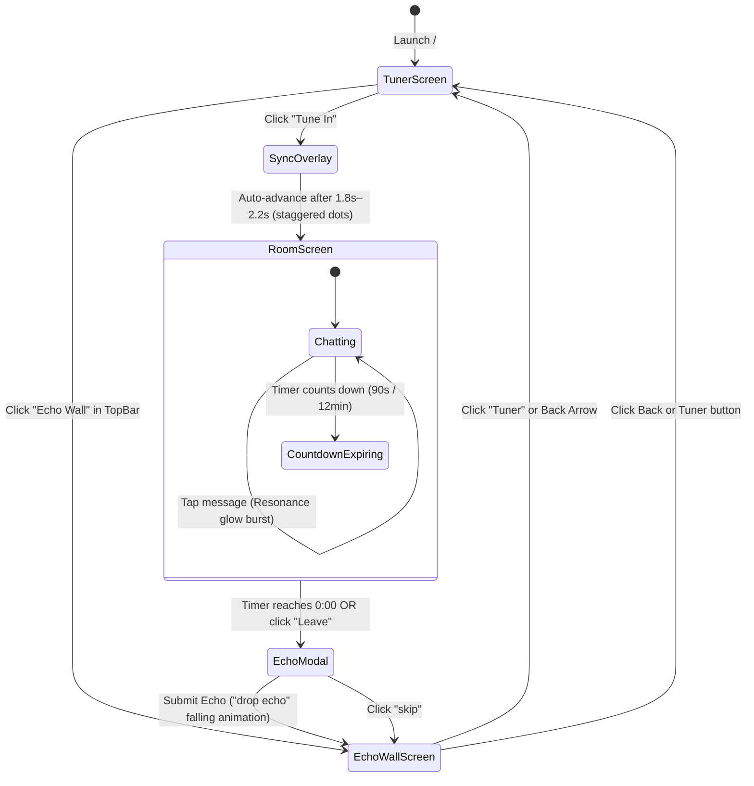

# 🌊 Wavelength — Architecture, Workflow & Status Guide

> **"Not who you follow. Who you're in sync with, right now."**
> A synchronous, ephemeral social space built without user profiles, follower counts, popularity algorithms, or permanent chat logs.

---

## 📋 Table of Contents
1. [Project Overview & Philosophy](#1-project-overview--philosophy)
2. [Where We Left Off & Continuity History](#2-where-we-left-off--continuity-history)
3. [End-to-End Application Workflow](#3-end-to-end-application-workflow)
4. [Component Architecture & Hierarchy](#4-component-architecture--hierarchy)
5. [Data Architecture & Simulation Engine](#5-data-architecture--simulation-engine)
6. [Design System & Motion Specifications](#6-design-system--motion-specifications)
7. [Completed Implementations & Polish](#7-completed-implementations--polish)
8. [Developer Quickstart & Verification](#8-developer-quickstart--verification)

---

## 1. Project Overview & Philosophy

**Wavelength** is an intentional reimagining of social connection on the web:
- **Zero Identity**: No accounts, login forms, passwords, or personal profiles. Every session assigns pseudonyms like `stranger_42` or `stranger_07`.
- **Zero Asynchronous Clutter**: Conversations exist exclusively inside active 12-minute synchronous rooms (shortened to ~90s in Demo Mode). Once a room expires, chat history dissolves into the void.
- **Resonance Over Likes**: Tapping another participant's message triggers an ambient light pulse and boosts the collective room meter. There are **no numeric like counters**, no leaderboards, and no competitive engagement mechanics.
- **Echo System**: When a room closes, participants are offered a single-line reflection (~80 character limit) to leave behind for strangers on the same wavelength. These "Echoes" are displayed chronologically without ranking.

---

## 2. Where We Left Off & Continuity History

### Context from Previous Session (`798b8dd2-dfec-4f5e-a300-d253b33b65b8`)
During the initial build phase, the entire foundation and UI components were developed across 5 major phases:
1. **Phase 1: Foundation** — Setup Vite, Tailwind CSS v4, Framer Motion, Lucide icons, and static emotional frequency datasets.
2. **Phase 2: Tuner Screen** — Dynamic circular dial, frequency readout, live audience counter, and interactive canvas sine-wave background.
3. **Phase 3: Room & Sync Engine** — Full-screen radar scan transition, live room simulation, avatar stack, countdown ring, ephemeral chat stream, and resonance meter.
4. **Phase 4: Echo System** — Post-session ritual modal, echo wall with frequency filter chips, and localStorage persistence.
5. **Phase 5: App Shell & Routing** — State-machine app controller in `App.jsx`, layout top bar, and helper utilities.
6. **Phase 6: Production Build & QA** — Production build succeeded (`npm run build` generated production assets with 0 errors). The Vite dev server was launched on `http://localhost:5173/`.

### Exactly Where the Previous Session Was Interrupted
At step 95 of the previous session, an autonomous browser subagent was dispatched to capture screenshots and perform visual end-to-end verification. However, the browser environment encountered an external dependency error: Playwright's automated browser driver download returned a 404 from upstream Azure edge mirrors (`playwright-1.57.0-win32_x64.zip`), preventing headless browser initialization. The conversation ended before the walkthrough summary and markdown workflow documentation could be written.

### Actions Taken in This Session to Complete the Work
- **Resolved ESLint & React Compiler Warnings**:
  - `SyncOverlay.jsx`: Fixed impure `Math.random()` call in render using a state initializer (`useState(() => Math.floor(Math.random() * 3) + 4)`).
  - `RoomAvatarStack.jsx`: Replaced random render durations with deterministic indexing (`duration: 2 + (index % 3) * 0.4`), and protected against undefined avatar names.
  - `FrequencyDial.jsx`: Removed unused `AnimatePresence` import and unused coordinate variables (`rad`, `innerR`).
  - `FrequencyReadout.jsx`: Derives `displayCount` synchronously on frequency changes instead of calling `setState` inside an effect.
  - `useRoomSimulation.js`: Re-ordered `sendSimulatedMessage` using a callback ref to eliminate self-referencing declaration warnings and removed empty redundant effects.
  - `App.jsx`: Removed unused `myEchoes` destructuring.
- **Added Direct Navigation in `TopBar.jsx`**:
  - Users can now browse the **Echo Wall** directly from the Tuner screen via a top-bar pill button.
  - When in the Echo Wall, users can return to the Tuner by clicking the **Wavelength** brand logo or the **Tuner** button.
- **Added Room Exit Control in `RoomHeader.jsx`**:
  - Added a graceful `Leave` button (door/logout icon) next to the countdown ring. Leaving early triggers the ritual **Echo Modal** so testers and users are not forced to wait out the timer.
- **Re-Verified Clean Production Build**:
  - `npm run build` compiles completely clean in ~8s with zero errors.
  - Dev server verified active and serving HTTP 200 on `http://localhost:5173/`.

---

## 3. End-to-End Application Workflow

The entire application runs as a cohesive, single-page state machine without page reloads or jarring navigation.



### Stage Details

#### 1. Tuner Screen (`tuner`)
- **Interactive Frequency Dial**:
  - 8 emotional frequencies (e.g., *Can't sleep, mind's racing*, *New city, no friends yet*, *Quietly proud of myself today*).
  - Rotatable with spring physics using drag gestures, mouse wheel scrolling, or keyboard Arrow keys (`ArrowLeft`, `ArrowRight`, `ArrowUp`, `ArrowDown`).
  - Accessible slider semantics (`role="slider"`, `aria-valuenow`, `aria-valuetext`).
- **Dynamic Waveform Canvas**:
  - Full-screen animated canvas morphing 3 layered sine waves using `requestAnimationFrame`.
  - Automatically paused when the browser tab is hidden (`visibilitychange`).
  - Seamless color shifts to match the currently selected frequency accent.
- **Live Readout**:
  - Displays frequency title, evocative description, and active audience count with organic fluctuation.
- **Tune In Button**:
  - Primary glowing CTA button that initiates connection.

#### 2. Sync Overlay (`syncing`)
- Full-screen immersion state displaying a radial scan pulse.
- Pulsing concentric rings with randomized participant discovery dots (4 to 6 people).
- Announces *"finding your frequency..."* with an animated count: *"X people syncing"*.
- Automatically resolves after 1.8–2.2 seconds to seamlessly drop the user into the room.

#### 3. Room Screen (`room`)
- **Header**:
  - Displays frequency label, waveform badge, and an SVG `CountdownRing`.
  - Color transitions dynamically from purple/blue to urgent amber when ≤ 60s remain.
  - Screen reader announcements fired selectively at 60s and 10s to avoid audio clutter.
  - Interactive "Leave" button allowing graceful early departure.
- **Avatar Stack**:
  - Pseudonymous participant indicators (e.g., `stranger_14`, `stranger_82`).
  - Gentle ambient breathing rings around each participant.
- **Resonance Meter**:
  - Subtle top gauge reflecting collective emotional energy.
  - Tapping message bubbles triggers a light pulse on the message and fills the meter.
- **Message Stream & Composer**:
  - Autonomous simulation engine sends contextual, realistic messages from participants on a 3–7s cadence.
  - Bottom input bar allows sending messages as `you:`.
  - Auto-scrolls smoothly to new entries.

#### 4. Echo Modal (`echoModal`)
- Modal overlay providing ritual closure when the room terminates.
- One single-line input capped at 80 characters.
- *"leave an echo — one line for the next people who tune into this frequency"*.
- Submitting triggers a gentle falling fade animation before navigating to the Echo Wall.

#### 5. Echo Wall (`echoWall`)
- Public, anonymous repository of past thoughts left behind.
- Horizontal scrollable filter chips to filter echoes by emotional frequency.
- Combines curated seed echoes with newly created user echoes from `localStorage`.
- Strict anti-popularity design: no view counts, no upvotes, no sorting by popularity.

---

## 4. Component Architecture & Hierarchy

```
src/
├── App.jsx                     # Top-level state machine controller
├── main.jsx                    # React 19 root entry
├── index.css                   # Design system tokens & Tailwind v4
│
├── components/
│   ├── TopBar.jsx              # Navigation header (Wavelength logo + Echo Wall link)
│   ├── AmbientWaveformBackground.jsx # Canvas sine-wave animator
│   ├── FrequencyDial.jsx       # SVG circular dial with drag & keyboard support
│   ├── FrequencyReadout.jsx    # Live count & label with crossfade animations
│   ├── TuneInButton.jsx        # Glowing primary CTA button
│   ├── SyncOverlay.jsx         # Radial radar scanning transition
│   ├── CountdownRing.jsx       # SVG circular countdown timer with color shifts
│   ├── RoomHeader.jsx          # Room top bar (title, countdown, leave action)
│   ├── RoomAvatarStack.jsx     # Pseudonymous avatar row with pulse rings
│   ├── ResonanceMeter.jsx      # Collective energy ambient bar
│   ├── MessageStream.jsx       # Auto-scrolling chat message container
│   ├── MessageBubble.jsx       # Message bubble with resonance tap gesture
│   ├── MessageComposer.jsx     # Pinned bottom text composer
│   ├── EchoModal.jsx           # Post-session single-line reflection modal
│   ├── FrequencyFilterChips.jsx# Filter chips row for Echo Wall
│   └── EchoCard.jsx            # Individual anonymous echo card
│
├── pages/
│   ├── TunerScreen.jsx         # Home / Dial landing page
│   ├── RoomScreen.jsx          # Synchronous room experience
│   └── EchoWallScreen.jsx      # Echo browsing gallery
│
├── hooks/
│   ├── useDial.js              # Dial rotation, index snapping, & keyboard controls
│   ├── useCountdown.js         # Tick timer with demo mode (90s) and completion callback
│   ├── useRoomSimulation.js    # Simulated participant messaging & resonance engine
│   └── useLocalStorage.js      # Safe browser storage read/write
│
├── utils/
│   ├── formatTime.js           # MM:SS time formatter
│   ├── generateStrangerName.js # stranger_XX randomizer
│   └── pickMockParticipants.js # Pool sampling helper
│
└── data/
    ├── frequencies.json        # 8 emotional frequencies with colors and copy
    ├── mockParticipants.json   # 12 participant profiles + message pools
    └── seedEchoes.json         # Seed reflections per frequency
```

---

## 5. Data Architecture & Simulation Engine

### Emotional Frequencies (`frequencies.json`)
The application is anchored by 8 distinct emotional states:

| Frequency ID | Label | Mood | Color Accent | Live Audience |
| :--- | :--- | :--- | :--- | :--- |
| `freq_racing_mind` | *Can't sleep, mind's racing* | Restless | `#7C5CFF` (Purple) | ~2,847 |
| `freq_new_city` | *New city, no friends yet* | Hopeful-Lonely | `#33E6C9` (Teal) | ~412 |
| `freq_excited_noone`| *Excited and can't tell anyone* | Electric | `#FFB020` (Amber) | ~1,203 |
| `freq_post_breakup` | *Post-breakup clarity* | Bittersweet | `#FF4FA3` (Pink) | ~890 |
| `freq_sunday_scaries`| *Sunday scaries hitting early* | Anxious | `#FF5470` (Coral Red)| ~1,567 |
| `freq_quiet_proud` | *Quietly proud of myself today* | Warm | `#FFD166` (Gold) | ~634 |
| `freq_missing_someone`| *Missing someone I can't text*| Aching | `#A78BFA` (Lavender) | ~1,891 |
| `freq_fresh_start` | *Ready for a fresh start* | Determined | `#34D399` (Emerald) | ~723 |

### Participant Simulation (`useRoomSimulation.js`)
- Selects 4 to 6 random pseudonyms from `mockParticipants.json` upon room initialization.
- Shuffles frequency-specific message pools.
- Dispatches messages at randomized human cadences (every 3 to 7 seconds).
- Handles incoming user messages with instantaneous insertion into the stream.
- Supports the resonance mechanism: clicking any stranger's message triggers a glow flash and feeds into the collective room resonance meter.

---

## 6. Design System & Motion Specifications

Defined in `src/index.css` using Tailwind CSS v4 and CSS variables:

### Color Palette
- `--color-bg`: `#05060A` (Deep midnight void)
- `--color-surface`: `#10131C` (Dark obsidian card surface)
- `--color-surface-2`: `#171B27` (Input & highlight surface)
- `--color-border`: `#232733` (Subtle boundary line)
- `--color-text-primary`: `#F5F3F7` (High-contrast soft white)
- `--color-text-secondary`: `#9A96AC` (Muted violet-gray)
- `--color-gradient-start`: `#7C5CFF`
- `--color-gradient-end`: `#FF4FA3`
- `--color-accent-live`: `#FFB020`
- `--color-accent-resonance`: `#33E6C9`

### Typography Scale
- **Display / Headers**: `Space Grotesk`, sans-serif (Weights: 500, 600, 700)
- **Body / Chat**: `Inter`, sans-serif (Weights: 400, 500, 600)
- **Mono / Timers / Counters**: `JetBrains Mono`, monospace (Weight: 500)

### Motion Principles
- **Spring Physics**: Modals and dial snapping utilize Framer Motion springs (`stiffness: 300–400`, `damping: 20–25`) for tactile responsiveness.
- **Micro-Interactions**: Hover states on buttons, cards, and avatars feature subtle elevation and glow blooms.
- **Reduced Motion Support**: Fully respects `@media (prefers-reduced-motion: reduce)` by collapsing transition durations and falling back to a static waveform canvas.

---

## 7. Completed Implementations & Polish

- [x] **Vite + React 19 + Tailwind v4** configuration.
- [x] Full responsive layout tested for viewport widths down to **320px**.
- [x] Keyboard operable frequency dial with Arrow navigation and ARIA slider attributes.
- [x] Dynamic animated canvas background that matches active frequency colors.
- [x] Staggered radar scan sync overlay.
- [x] Simulated multi-user chat room with natural message timings.
- [x] Accessible countdown ring with warning color transitions (amber at 60s, red at 10s).
- [x] Non-competitive resonance pulse on message click.
- [x] Ritual post-session Echo modal with falling transition.
- [x] Filterable Echo Wall screen with frequency category chips.
- [x] LocalStorage persistence for user-created echoes.
- [x] Direct navigation between Tuner and Echo Wall in `TopBar`.
- [x] Early exit capability in `RoomHeader` to allow closing or testing the room on demand.
- [x] Interactive Demo Mode toggle (`90s Demo` vs `12m Standard`) in `TopBar`.
- [x] Host network exposure enabled in `vite.config.js` for testing across mobile devices.
- [x] Clean zero-error linter report and verified production build.

---

## 8. Developer Quickstart & Verification

### Running Locally
To run the local development server:
```bash
npm run dev
```
The server will start at:
👉 **`http://localhost:5173/`**

### Running the Production Build
To create a production-ready bundle:
```bash
npm run build
```
Output bundle:
- `dist/index.html`: ~1.02 kB
- `dist/assets/*.css`: ~12.8 kB (gzipped: 3.3 kB)
- `dist/assets/*.js`: ~362 kB (gzipped: 113.9 kB)

### Running Code Quality Checks
To run the project linter:
```bash
npm run lint
```
OxLint inspects all files across rules for React 19 compatibility and code purity with 0 errors.

### Interactive User Testing Checklist
1. **Dial Interaction**: Drag the center dial or press Left/Right/Up/Down arrow keys on your keyboard to cycle through the 8 frequencies. Observe the canvas waveform background changing color to match each mood.
2. **Direct Echo Wall**: Click **Echo Wall** in the top right to browse anonymous thoughts left by previous visitors. Click any frequency chip to filter the list. Click **Tuner** or the back arrow to return.
3. **Tune In**: Click the glowing **Tune In** button. Watch the radial scan pulse ring and participant dots connect.
4. **Room Chat**: Once inside the room, watch the countdown timer ring and observe messages from strangers appearing. Click any message to resonate (observe the glowing burst). Type a message in the bottom composer and press Enter to send.
5. **Leave & Echo**: Click the leave icon in the top right (or let the countdown reach 0:00). Enter a one-line reflection in the Echo Modal and click **drop echo**. Watch it animate into the Echo Wall where your new reflection is now preserved.
