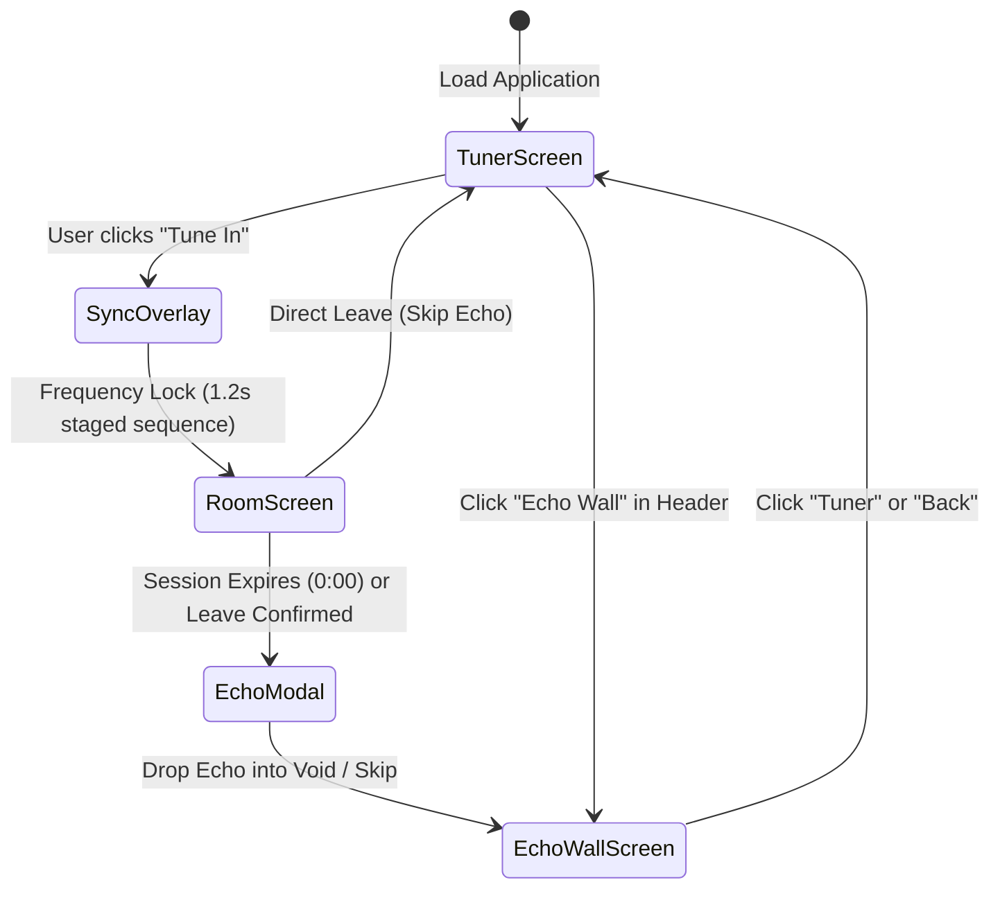

# 🏛️ Wavelength — Architecture & Systems Specification

> **Canonical Production URL**: [https://wavelength-social.vercel.app](https://wavelength-social.vercel.app)  
> **Source Repository**: [https://github.com/chetanbhagore/Wavelength](https://github.com/chetanbhagore/Wavelength)  
> **Submission Track**: REIMAGINE SOCIAL — Design the Next Generation of Social Interaction

---

## 1. System Overview & Philosophy

Wavelength is an ephemeral, synchronous social web application designed around the physical metaphor of an **analog emotional radio**. It discards the paradigm of permanent personal identity, algorithmic feeds, and metric vanity (likes, followers, retweets) in favor of **real-time collective presence**.

### Core Tenets:
1. **Zero Permanent Profiles**: Users are anonymous presences (`stranger_XX`) generated per session.
2. **Synchronous 12-Minute Timebox**: Rooms dissolve forever into the void with zero server logs.
3. **Collective Resonance over Vanity**: Affirmation triggers a room-wide ambient light wave, not a counter.
4. **Physical Presence Residue**: Leaving deposits an anonymous, organic thermal-receipt echo card and a ghost halo on the dial.

---

## 2. Component Hierarchy & File Structure

```
src/
├── components/                     # Pure Reusable UI Components (with 100% PropTypes)
│   ├── AmbientAudioToggle.jsx      # Web Audio drone toggle with equalizer wave bars
│   ├── AmbientWaveformBackground.jsx# Canvas mood-reactive particle & waveform engine
│   ├── ConstellationRadar.jsx      # Global city presence radar
│   ├── CountdownRing.jsx           # Circular SVG session countdown timer
│   ├── DepartureModal.jsx          # Poetic early leave confirmation dialog
│   ├── EchoCard.jsx                # Material thermal paper receipt cards
│   ├── EchoModal.jsx               # Gravity drop reflection modal
│   ├── ErrorBoundary.jsx           # React Error Boundary with analog signal recovery
│   ├── FloatingWhispers.jsx        # Orbital thought fragments drifting in ether
│   ├── FrequencyDial.jsx           # Interactive analog rotary dial with MHz detents
│   ├── FrequencyFilterChips.jsx    # Mood-reactive filter pills with detent audio
│   ├── FrequencyReadout.jsx        # MHz broadcast readout & Brownian presence model
│   ├── FrequencySpectrumRibbon.jsx # Horizontal band navigator
│   ├── MessageBubble.jsx           # Individual message bubble (React.memo optimized)
│   ├── MessageComposer.jsx         # Input field with safe-area & countdown cue
│   ├── MessageStream.jsx           # Auto-scrolling conversation stream
│   ├── ResonanceMeter.jsx          # Collective energy bar with surge light flash
│   ├── RoomAvatarStack.jsx         # Living stranger avatars with breathing cycles
│   ├── RoomHeader.jsx              # Frequency title, countdown, and leave action
│   ├── SignalCursor.jsx            # Zero-lag hardware-accelerated probe cursor
│   ├── SyncOverlay.jsx             # Staged frequency lock & carrier wave overlay
│   ├── TopBar.jsx                  # Header navigation & discoverable demo toggle
│   └── TuneInButton.jsx            # Primary obsidian gradient CTA
├── pages/                          # Primary Screen Views (Validated with PropTypes)
│   ├── TunerScreen.jsx             # Analog tuning homepage & ether atmosphere
│   ├── RoomScreen.jsx              # Synchronous 12-minute ephemeral chatroom
│   └── EchoWallScreen.jsx          # Lazy-loaded historical residual echo wall
├── context/                        # Global State Management Layer
│   └── AppStateContext.jsx         # Explicit 5-stage navigation state machine & context
├── services/                       # Business Domain Logic Layer
│   └── RoomService.js              # Echo creation, resonance math, and message domain logic
├── constants/                      # Centralized Configuration & Magic Numbers
│   └── index.js                    # Timing, session durations, breakpoints, storage keys
├── types/                          # Shared Type Contract Definitions
│   └── propTypes.js                # Centralized PropTypes shapes (Frequency, Message, Echo, etc.)
├── hooks/                          # Custom Behavioral & State Hooks
│   ├── useAppState.js              # Custom hook consuming AppStateContext
│   ├── useCountdown.js             # High-precision timer with demo/standard modes
│   ├── useDial.js                  # Rotary index tracking & keyboard navigation
│   ├── useLocalStorage.js          # Resilient storage hook for client-side state
│   └── useRoomSimulation.js        # Multi-agent stochastic peer simulation
├── data/                           # Static Configuration & Seed Datasets
│   ├── frequencies.json            # 8 broadcast frequencies & emotional attributes
│   ├── mockParticipants.json       # Synthetic avatar seeds & conversation pools
│   └── seedEchoes.json             # Initial residual echoes per frequency
├── utils/                          # Pure Functional Utilities & Audio Synthesis
│   ├── ambientAudio.js             # Pure Web Audio API synthesis (zero audio files)
│   ├── formatTime.js               # Minutes/seconds time formatter
│   ├── generateStrangerName.js     # Anonymous ID generator
│   └── pickMockParticipants.js     # Deterministic participant selector
├── App.jsx                         # Thin presentation shell consuming AppStateContext
├── index.css                       # Multi-breakpoint responsive design engine & reset
└── main.jsx                        # React root entry point
```

---

## 3. Explicit State Machine Architecture

The entire application runs on an explicit, linear 5-stage state machine isolated in `AppStateContext.jsx` and consumed via the `useAppState` hook:



### State Definitions:
- `tuner`: Persistent starting point. Allows browsing frequencies via mouse drag, arrow keys, ribbon, or clicking whispers.
- `syncing`: Staged RF lock sequence. Plays pure 528Hz sine lock chime, sweeps needle to exact MHz band, and staggers stranger arrivals.
- `room`: Ephemeral living space with active participant simulation, collective resonance, and sacred 30-second broadcast dissolution.
- `echoModal`: Irreversible gravity drop reflection modal.
- `echoWall`: Chronological, non-algorithmic archive of residual thoughts organized by frequency.

---

## 4. Why Frontend-Only Architecture?

1. **Radical Privacy & Ephemerality**: By avoiding centralized backends, databases, or third-party auth, user thoughts are physically impossible to harvest, leak, or sell. Messages live strictly in volatile memory during the active session.
2. **Zero Audio Asset Overhead**: All sound effects (mechanical rotary detents, 528Hz sine locks, binaural ether drones, sub-bass drop thuds) are synthesized **in real time via the Web Audio API**. Zero MP3/WAV network requests, ensuring instant load time.
3. **Deterministic Real-Time Simulation**: Uses an Ornstein-Uhlenbeck stochastic drift model for room audience fluctuations and simulated peer cadence to deliver a vibrant, populated atmosphere regardless of concurrent real-world traffic.

---

## 5. Multi-Agent Simulation Engine (`useRoomSimulation.js`)

The room is populated with synthetic peers executing three concurrent behaviors:
1. **Conversational Cadence**: Initial icebreaker drops within 2.5s–3.5s of entering the room. Subsequent messages follow randomized human reading and typing intervals (1.6s–3.2s).
2. **Typing Indicators**: Active avatars pulse with luminous beacon dots (`stranger_XX is typing...`) before messages appear.
3. **Peer Resonance Surge**: Peers periodically resonate with messages in the room (with higher probability for user contributions), triggering collective room-wide backdrop light waves.

---

## 6. Performance & Responsive Design Engineering

- **Viewport Fluidity**: Completely fluid from **320px** (iPhone 5/SE legacy) up to **4K Ultra-Wide**.
- **Touch-First Ergonomics**: All interactive elements adhere to a minimum **44px × 44px** touch target standard.
- **Hardware Acceleration**: Dial rotation, cursor tracking, and page transitions rely exclusively on GPU-composited `transform` and `opacity` properties.
- **Retina DPR Throttling**: Canvas device pixel ratio is clamped to `Math.min(window.devicePixelRatio, 2)` to eliminate fill-rate bottlenecks on 3x Retina displays.
- **Reduced Motion Fallback**: Complete `@media (prefers-reduced-motion: reduce)` support disables heavy particle animations and replaces canvas waves with a clean static gradient.
